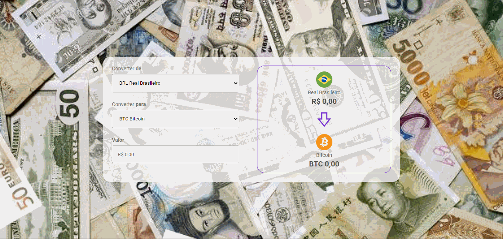

# Conversor de Moedas

  

Projeto de conversor de moeda para aprender outras tecnologias e praticar.
 
Nesse projeto: 
- Tem responsividade mobile first (estilização pensada primeiro no celular, se acomodando a diferentes tamanhos de telas)
- Máscara (manipulação dos valores com o Regex), transformando para o formato da moeda selecionada assim que é digitado qualquer valor no input.
- Importação os dados das moedas a partir de uma conjunto de dados (array) e incluindo dinamicamente com a manipulação da DOM.
- Em breve, será incluído valores reais para conversão a partir do consumo de uma API
 

